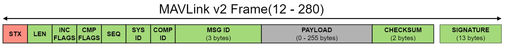

# Images test

Note that this markdown is in /en/guide/serialization.md
And the image  is located in both this guide folder and in the folder `/assets/packets/`, which is a peer


1. 
    

2. 
   

3. 
   

4. 
   
   
My index imports the alias: 
```
'/en/(.*)':
  'https://raw.githubusercontent.com/hamishwillee/mavlink-devguide/docsify_test/en/$1',
```

